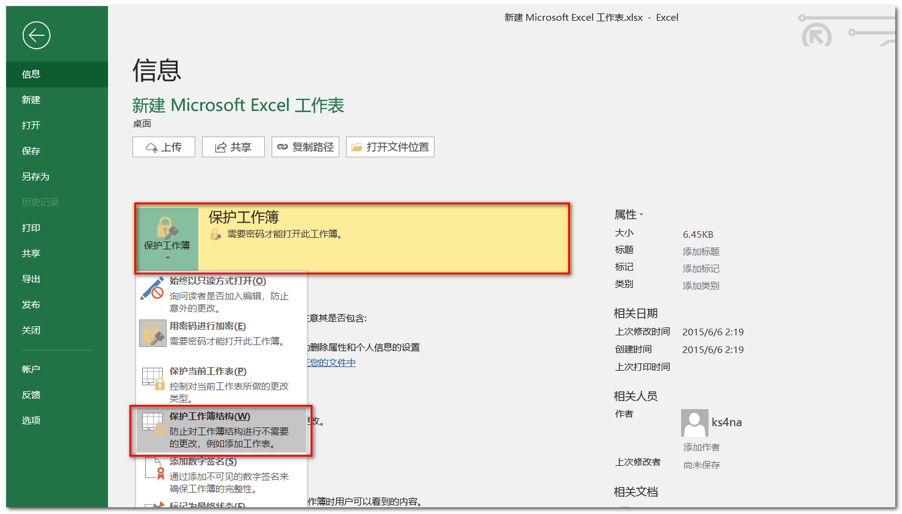
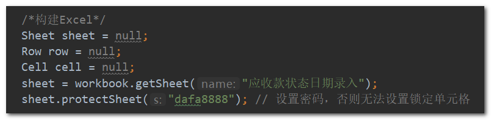
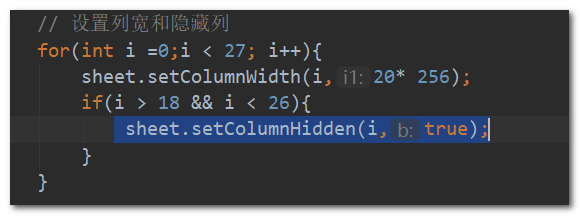

# 导出数据到Excel 

> 还是以“应收款状态日期录入”模块为例，具体代码可以查看该模块的源码。


## 步骤

1.  在 `init.jsp` 页面中定义一个 `form` 用于导出，将一些必要的字段放入 `form` 中隐藏域，将页面的数据 `dataList` 转为JSON字符串也放入 `form` 中某个隐藏域（这里是 `exportDataList` 字段）。

   ```html
   <!-- 导出数据form -->
   <div class="hide">
       <form id="exportForm" action="<%=basePath%>receivables-report/exportExcel" method="post">
           <input type="hidden" name="exportCustomerName" id="exportCustomerName">
           <input type="hidden" name="exportRoomNumber" id="exportRoomNumber">
           <input type="hidden" name="exportBuildingName" id="exportBuildingName">
           <input type="hidden" name="exportCanEditStatus" id="exportCanEditStatus">
           <input type="hidden" name="exportBuildIdSet" id="exportBuildIdSet">
           <input type="hidden" name="exportDataList" id="exportDataList">
       </form>
   </div>
   ```

2. 在controller层定义 “导出”  按钮点击事件，`exportExcel` 方法在reaction层中定义：

   ```javascript
   // “导出”按钮点击事件
   $("#exportBtn").on("click", exportExcel)
   ```

3. 在reaction层中定义 `exportExcel` 方法，主要是将必要的数据设置到 `form` 中的域中，然后提交 `form` 表单： 

   ```javascript
   // 导出Excel
   function exportExcel(){
       var customerName = $("#customerName").val()
       var roomNumber = $("#roomNumber").val()
       var buildingName = $("#buildingName").val()
       var canEditStatus = $("#canEditStatus").find("option:selected").text()
       var buildIdSet = ""
       $.each($("#buildIdSet").find("a"), function(i ,ele){
           buildIdSet += $(ele).text() + ","
       })
       buildIdSet = buildIdSet.substr(0, buildIdSet.lastIndexOf(","))
   
       var dataListJsonStr = JSON.stringify(dataList)
       $("#exportCustomerName").val(customerName)
       $("#exportRoomNumber").val(roomNumber)
       $("#exportBuildingName").val(buildingName)
       $("#exportCanEditStatus").val(canEditStatus)
       $("#exportBuildIdSet").val(buildIdSet)
       $("#exportDataList").val(dataListJsonStr)
   
       $("#exportForm").submit()
   }
   ```
   
4. 接下来到action层将之前页面上 `form` 定义的路径实现：

   ```java
   @ResponseBody
   @RequestMapping(value="/exportExcel", method = RequestMethod.POST, produces = {"text/json;charset=UTF-8"})
   public String exportExcel(HttpServletRequest request, HttpServletResponse response, HttpSession session){
       response.setContentType("application/vnd.openxmlformats-officedocument.spreadsheetml.sheet;charset=UTF-8");
       String result = "error ";
       // 获取数据
       String dataList = request.getParameter("exportDataList");
       String customerName = request.getParameter("exportCustomerName");
       String roomNumber = request.getParameter("exportRoomNumber");
       String buildingName = request.getParameter("exportBuildingName");
       //        String approvalStatus = request.getParameter("exportApprovalStatus");
       String canEditStatus = request.getParameter("exportCanEditStatus");
       String buildIdSet = request.getParameter("exportBuildIdSet");
       if (null == dataList || dataList.length() < 1) {
           return "没有数据可导出";
       }
   
       FileInputStream fis = null;
       XSSFWorkbook workbook = null;
   
       try {
           String filepath = request.getSession().getServletContext().getRealPath("");
           fis = new FileInputStream(filepath + "/assets/expFileModel/应收款状态日期录入模板.xlsx");
           workbook = new XSSFWorkbook(fis);
       } catch (FileNotFoundException e1) {
           e1.printStackTrace();
       } catch (IOException e1) {
           e1.printStackTrace();
       }
   
       // 调用service层方法填充数据到workbook对象中
       rrSADIService.exportExcel(dataList, request, workbook);
   
       try {
           OutputStream out = response.getOutputStream();
   
           // 导出文件命名 : "应收款状态日期录入导出数据_" + 搜索条件+当前登录用户+日期+.xlsx
           String fileName = "应收款状态日期录入导出数据_";
           if(null != customerName && customerName != ""){
               fileName += "客户名称-" + customerName + "_";
           }
           if(null != roomNumber && roomNumber != ""){
               fileName += "房间号-" + roomNumber + "_";
           }
           if(null != buildingName && buildingName != ""){
               fileName += "楼栋名称-" + buildingName + "_";
           }
           if(null != canEditStatus &&  canEditStatus != ""){
               fileName += "可编辑状态-" + canEditStatus + "_";
           }
           if(null != buildIdSet && buildIdSet != ""){
               // 限制长度不超过20
               if(buildIdSet.length() > 20){
                   buildIdSet = buildIdSet.substring(0, 20);
                   buildIdSet += "......";
               }
               fileName += "房源-" + buildIdSet + "_";
           }
           fileName += session.getAttribute("USERID") + "_";
   
           SimpleDateFormat format = new SimpleDateFormat("yyyyMMdd");
           String datestr = format.format(new java.util.Date());
           fileName += datestr;
           fileName += ".xlsx";
           String agent = request.getHeader("USER-AGENT");
   
           if (agent != null && agent.indexOf("MSIE") != -1) {
               fileName = URLEncoder.encode(fileName, "UTF-8");
           } else { // IE
               fileName = URLEncoder.encode(fileName, "UTF-8");
               //filename = new String(filename.getBytes("UTF-8"), "ISO-8859-1");
           }
   
           response.addHeader("Content-Disposition", "attachment;filename="
                              + fileName);
           workbook.write(out);
           out.flush();
           out.close();
       } catch (Exception e) {
           e.printStackTrace();
       }
   
       return result;
   }
   ```

   这里使用的是 `POI` 的 `XSSFWorkbook ` ，要求excel文件的格式是 `xlsx` （新版Excel）而不是 `xls`。

   其中有一块读取excel模板的代码：

   ```java
   fis = new FileInputStream(filepath + "/assets/expFileModel/应收款状态日期录入模板.xlsx");
   ```

   这里首先是需要制作一个excel模板放到项目中相应的位置 `/web/assets/expFileModel`目录下。

5. 制作Excel模板很简单，只是用来控制Excel的一些属性不让更改：

   1. 保护工作簿，禁止改变工作簿的结构 ( 如新增sheet页等 ) :

      新建一个 `xlsx` 格式的Excel，改名为 `应收款状态日期录入模板` ，点击“文件”=>“保护工作簿”=>“保护工作簿结构”=> 设置密码:

      

   2. 将该excel模板文件放到 ` /web/assets/expFileModel ` 文件夹下。 

6. 导出数据到Excel，最重要的步骤是 ：

   ```java
   // 调用service层方法填充数据到workbook对象中
   rrSADIService.exportExcel(dataList, request, workbook);
   ```

   具体代码参看源码，需要注意的地方： 

   * sheet页要设置密码，否则无法设置锁定单元格，不然无法进行“锁定单元格”的操作；

     

   * `dataList` 传递过来的**所有字段最好都设置到Excel中，避免缺少字段导入的数据缺少信息**；而对于那些不需要显示的字段，可以在设置表头样式的时候，设置该列为“隐藏”：

        

     

