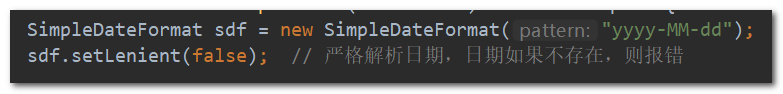

# 导入Excel数据

> 还是以“应收款状态日期录入”模块为例，由于导入Excel数据与该模块的业务耦合较强，所以这里只简单说明一下思路，具体实现可以查看该模块的源码。

## 步骤

1. 验证导入的excel文件是否正确；
2. 读取到需要的sheet页的对象，对每一行的数据调用验证方法进行验证：如果该条数据存在错误，用一个变量存储起来（用于一次性提示Excel中的所有数据错误），并继续验证接下来的其它行；
3. 最后如果没有错误，将拼接起来的xml字符串调用ABAP的方法保存，如果有错误，提示前台错误信息，数据无需保存。

## 注意点

1. 如果包含对时间字段的编辑，时间格式转换时，需要设置“**严格解析模式**”，防止输入“2018-11-31”这样的数据而不报错。 

   

2. 源码中的单元格样式命名不太友好，第一遍看可以忽略样式，先看整体代码结构，或者说先保证能够把数据输出到excel中适当的位置，然后再根据业务逻辑控制各个单元格的样式，此时再看源码中的设置单元格样式部分的代码。 

