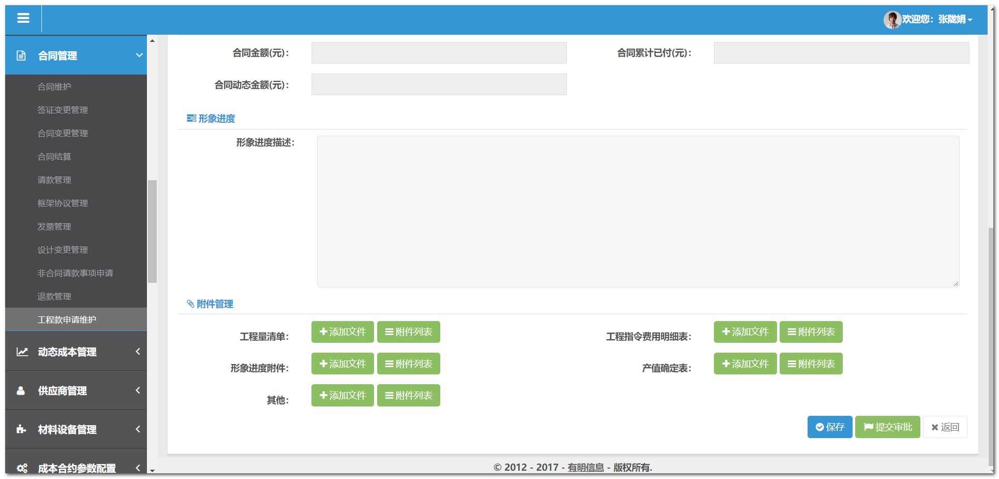
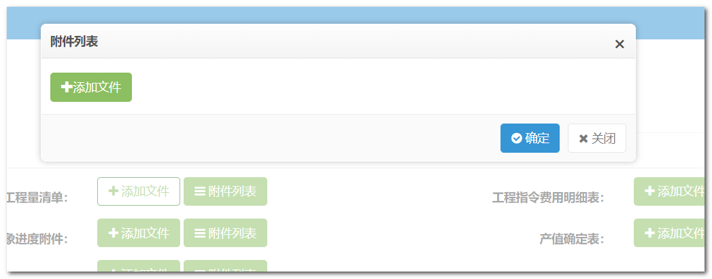
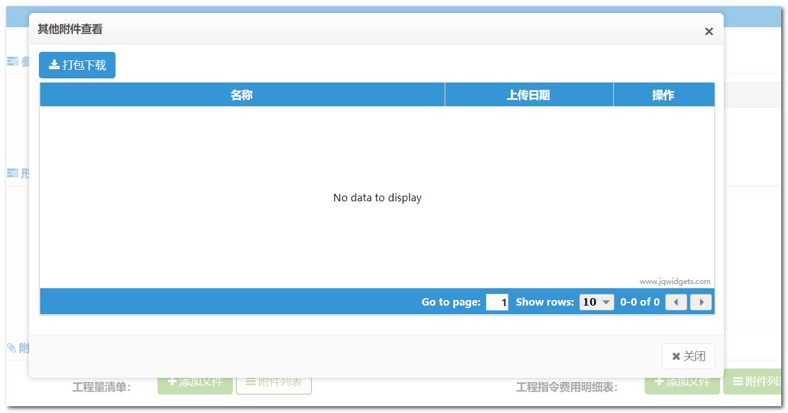

# 文件(附件)上传下载 

> 本节以“合同管理” -> “工程款申请维护” 模块为例，如有疑问可自行阅读该模块源码。



上图页面中“附件管理”一块的功能就包括文件上传，文件下载。 


## 文件上传

1. jsp页面中，“添加文件”按钮代码：

   ```html
   <button id="uploadFileSup1" type="button" class="btn btn-success" data-toggle="modal" data-target="#uploadFileModel1"><i class="fa fa-plus"></i> 添加文件</button>
   ```

   指定了 `data-target="#uploadFileModel1"` , 所以点击"添加文件"按钮则显示 `uploadFileModel1` 模态框 ；

2. `uploadFileModel1` 模态框如下图：

   

   代码是固定格式，如下所示，其中最重要的是 `#uploadFile1` 这个 `div`： 

   ```html
   <div class="modal fade" id="uploadFileModel1">
       <div class="modal-dialog">
           <div class="modal-content">
               <div class="modal-header">
                   <button type="button" class="close" data-dismiss="modal"
                           aria-hidden="true">&times;</button>
                   <h3 class="modal-title">附件列表</h3>
               </div>
               <div class="modal-body" style="height: 51px">
                   <form name="fileuploadForm" id="fileuploadForm" method="POST"
                         enctype="multipart/form-data">
                       <input type="text" name="businessId" id="businessId" hidden="true">
                       <input type="text" name="businessType" id="businessType" value="" hidden="true">
                       <div id="uploadFile1"
                            class="col-md-12 padding-none marbot10 martop7"></div>
                   </form>
               </div>
               <div class="modal-footer">
                   <a href="#" id="confirm" data-dismiss="modal" class="btn btn-primary"><i class="fa fa-check-circle"></i> 确定</a>
                   <a href="#" class="btn btn-default" data-dismiss="modal"><i class="fa fa-times"></i> 关闭</a>
               </div>
           </div>
       </div>
   </div>
   ```

3. js文件中对模态框中的 `#uploadFile1` 的 `div` 进行初始化，并且赋值给变量 ` huploadifyForSup1` ：

   ```javascript
   var huploadifyForSup1 = $('#uploadFile1').Huploadify({
       auto:false,
     fileTypeExts:'*.jpg;*.pneg;*.png;*.doc;*.xls;*.docx;*.xlsx;*.ppt;*.pptx;*.pdf;*.txt;*.TXT;*.dwg;*.bak;*.dwt;*.rar;*.zip;',
       multi:true,
       fileSizeLimit:102400,
       breakPoints:false,
       saveInfoLocal:true,
       uploader: $("#basePath").val() + 'fileUpload/files',
       getUploadedFilePath : $("#basePath").val() + 'fileUpload/fileList',
       showUploadedPercent:true,//是否实时显示上传的百分比，如20%
       //showUploadedSize:true,
       removeTimeout:1000
   });
   ```

4. 在适当的时候，调用方法上传文件。 本例中在点击“保存”按钮后，先保存其它信息，在保存后的回调函数中进行文件上传，具体代码参看 `z-chakanAndShenpi-reaction.js` 中的 `updateShenpi` 方法中, 该方法中保存接口的回调函数中有一个自定义的 `fileSubmit` 方法进行文件上传，该方法代码如下:

   ```javascript
   function fileSubmit(businessId) {
       /*附件上传*/
       var businessType1 = 117;//合同文本
   
       //…… other code
   
       uploadfileForSup1(businessType1, businessId);
   
       //…… other code
   
       //回写文件个数
       uploadedFileList1 = huploadifyForSup1.getFiles();
       $("#uploadFile1").find("button").find('.badge').text(uploadedFileList1.length);
       $("#fileLength1").text(uploadedFileList1.length);
   
       // …… other code
   }
   ```

   又调用了 `uploadfileForSup1 ` 方法，代码如下： 

   ```javascript
   //上传文件
   var uploadfileForSup1 = function(businessType,businessId){
       var obj = {"businessType" : businessType, "businessId" : businessId};
   
       huploadifyForSup1.setFormData(obj);
       huploadifyForSup1.upload('*');
   }
   ```

   简而言之，有了 `businessType` 和 `businessId` 之后，调用 `huploadifyForSup1` 变量的 `setFormData(obj)`方法设置这两个值到 `huploadifyForSup1`  中，再调用 `upload('*')` 即可上传文件。

   > 注意： `fileSubmit` 函数中的  **回写文件个数** 这个步骤是必要的，上传成功后，要让 **附件列表** 按钮中显示已存在的附件个数。 


## 文件下载 

- “附件列表”按钮点击后会出现一个模态框:



如果需要的是这种效果，页面中的代码如下：

```html
<button id="showFile1" type="button" class="btn btn-success" data-toggle="modal" data-target="#modal-7"><i class="fa fa-navicon"></i> 附件列表<span id="fileLength1" class="badge"></span></button>
```

首先“附件列表”按钮的 `data-target` 指向 `modal-7` 这个模态框，模态框代码： 

```html
<!-- 附件查看  开始 -->
<div class="modal fade in" id="modal-7" aria-hidden="false">
    <div class="modal-dialog modal-lg ui-draggable" style="">
        <div class="modal-content">
            <div class="modal-header">
                <button type="button" class="close" data-dismiss="modal" aria-hidden="true">×</button>
                <h3 class="modal-title">其他附件查看</h3>
            </div>
            <div class="modal-body">
                <form class="form-horizontal" role="form">
                    <div class="row">
                        <div class="col-md-12">
                            <div id="uploadgrid1"></div>
                        </div>
                    </div>
                </form>
            </div>
            <div class="modal-footer">
                <a href="#" class="btn btn-default" data-dismiss="modal"><i class="fa fa-times"></i>&nbsp;关闭</a>
            </div>
        </div>
    </div>
</div>
<!--附件列表弹窗 结束-->
```

其中有个 `div` 的id为 `uploadgrid1`,这个 `div` 就是用来显示附件列表的 ，然后到controller层中定义“附件列表”按钮点击事件：

```javascript
$("#showFile1").live("click",function(){
    $("#uploadgrid1").jqxGrid("clear");
    //*合同文本
    var businessType = 117;
    var businessId = $('#ZGCKSQ').val();
    getSupplierBidFile(businessType,businessId);
    createMoreUploadFileListGrid("#uploadgrid1",businessId);
    $('#uploadgrid1').jqxGrid({ rowsheight: 38});
});
```

代码格式也是基本固定的，有了 `businessType ` 和 `businessId ` 之后，调用 `getSupplierBidFile` 和 `createMoreUploadFileListGrid` 方法即可，这两个方法是公用方法，定义在 `/web/business/co/common/queryFile.js` 文件中，所以需要在jsp中首先引入这个js文件：

```html
<script type="text/javascript" src="<%=basePath%>business/co/common/queryFile.js?<%=appVersion %>"></script>
```


- 获取上传的文件的详细信息 

> 这个很常用，在提交数据给OA时经常使用。 

```javascript
// 定义变量uploadedFileList1 保存上传的文件的详细信息
uploadedFileList1 = huploadifyForSup1.getFiles();
```

> 注意点：
>
> 传递给OA的附件信息需要改变PTHNAM 变量为**绝对地址**：
>
> ```javascript
> if(uploadedFileList1.length > 0){
>     for(var i = 0; i < uploadedFileList1.length; i++){
>         var url = requestHost + encodeURI('fileUpload/download?fileName='
>                    + encodeURIComponent(uploadedFileList1[i].PTHNAM) + '&fileLength=' 
>                    + uploadedFileList1[i].FILSIZ + '&s_fileName='
>                    + encodeURIComponent(uploadedFileList1[i].S_FILENAME));
>         uploadedFileList1[i].PTHNAM = url;
>     }
> 
>     //…… other code
> }
> ```


 