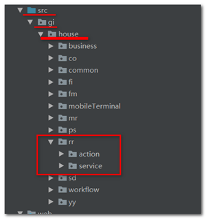
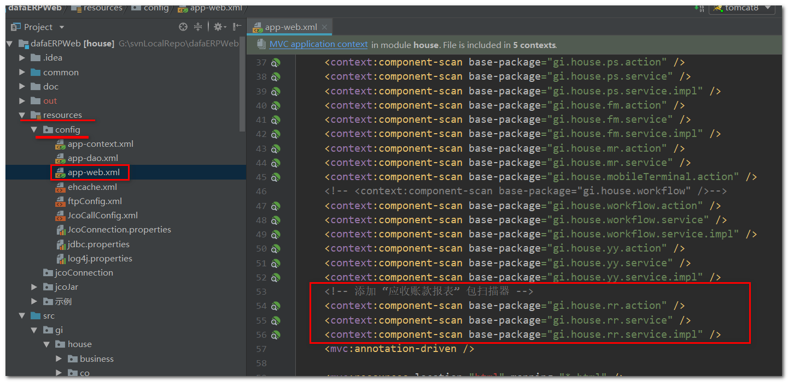

# 注意事项

1. 如果初次拉取代码，设置完环境，出现 **登录页提示登录失败** 的情况，先去IDEA看一下，tomcat版本号，可能需要更换为 **8.5版本或以上** 。

2. 前端js的ajax回调函数，返回的 **data.DATA.item 应该是数组的情况** 下，可能只有一条数据，此时可能返回值不是数组，为了确保没有问题， **最好使用` $.makeArray() `包装成数组** 。 

3. java新增模块时，需要在 `resources/config/app-web.xml` 中添加包扫描器。 

   * 以应收款模块为例 ,在 `src/gi/house ` 文件夹下新增了“应收款”模块的文件夹 `rr` ：

      

   * 需要新增包扫描器： 

     

4. 待补充