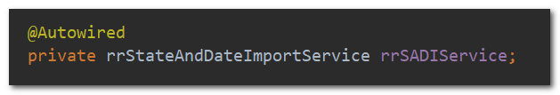
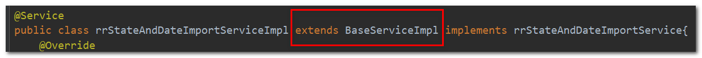
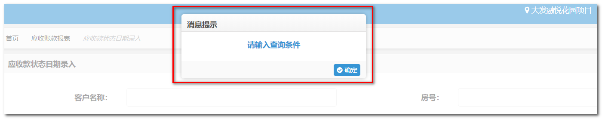

# 页面发送/获取请求数据 

> 还是以“应收款状态日期录入”模块为例 。


##步骤

```javascript
function querySearchData(field, from, to, xmwbs){
    var conditions = new Array()
    if(field){
        var condition = createOneCondition("FIELD", field, "EQ")
        conditions.push(condition)
    }
    if(from){
        var condition = createOneCondition("FROM", from, "EQ")
        conditions.push(condition)
    }
    if(to){
        var condition = createOneCondition("TO", to, "EQ")
        conditions.push(condition)
    }
    if(xmwbs){
        var condition = createOneCondition("XMWBS", xmwbs, "EQ")
        conditions.push(condition)
    }
    var condition = createCondition(conditions)
    var param = {
        item: JSON.stringify(condition)
    }

    // 封装好的请求方式，该请求方式会添加loading状态显示
    callAjax($("#basePath").val() + "receivables-report/fetchSearchData", "POST", param, function(res){
	//some code…      
    })
}
```

上面这段代码，首先定义一个 `conditions` 数组，然后将要传给后台的参数用 `createOneCondition` 方法包装成特定的格式塞入 `conditions` 数组，然后调用 `callAjax` 发送ajax请求，将 `conditions` 序列化成JSON字符串作为参数传递给Java后台。这里 `createOneCondition` 方法定义在 `/web/js/custom/common/common.js` 文件中：

 ```javascript
function createOneCondition(fieldname, valList, type) {
	var condition = new Object();
	var dataList = new Array();
	if (valList instanceof Array) {
		for ( var i = 0; i < valList.length; i++) {
			var data = new queryCondition("I", type, "", "");
			data.LOW = valList[i];
			dataList.push(data);
		}
	} else {
		var data = new queryCondition("I", type, "", "");
		data.LOW = valList;
		dataList.push(data);
	}
	condition.FIELDNAME = fieldname;
	condition.DATA = dataList;

	return condition;
}
 ```

第一个参数是传递给后台的字段的名称，第二个是字段对应的值，第三个可以固定写“EQ”。【其中**第二个字段可以是数组**】。一般情况下向后台传参就只需要 `createOneCondition` 进行入参的包装就行了。

`callAjax` 是一个封装好的ajax调用方法，**该方法会添加loading显示**，如果不需要显示loading状态，可以自己手写jquery的ajax请求而不使用该方法。另外，**无需手动引入该方法的js文件**（应该是已经在头文件中引入过了）。


接下来，来到java代码目录下对应的action文件中，添加刚刚的ajax请求对应的url —— `/fetchSearchData ` 的处理方法： 

```java
@ResponseBody
@RequestMapping(value="/fetchSearchData", method = RequestMethod.POST, produces = {"text/json;charset=UTF-8"})
public String fetchSearchData(HttpServletRequest request, HttpSession session){
    String item = request.getParameter("item");
    JSONArray jo1 = JSONArray.fromObject(item);
    Object[] obj = {jo1};
    String[] xPaths = {"DATA/item"};
    MapperType[] type = {MapperType.NOCHANGE};
    String inputXml = xmlConvertFromXpath(xPaths, obj, type);
    String result = rrSADIService.fetchSearchData(inputXml, session);
    return result;
}
```

这段代码中 ` produces = {"text/json;charset=UTF-8"} ` 别忘了，这个可以保证返回的json字符串中的中文不乱码。

由于这个项目是SAP管理后台数据库，所以Java需要调用ABAP端的接口获取数据。这个项目中Java与ABAP交互使用的是XML格式，所以，这段代码先将接收到的字符串转换为XML格式的字符串，然后调用service层的方法返回结果result，再返回给前端页面。JSON字符串转换为XML字符串的方式基本也是固定的：

 ```java
 String item = request.getParameter("item");
 JSONArray jo1 = JSONArray.fromObject(item);
 Object[] obj = {jo1};
 String[] xPaths = {"DATA/item"};  //这个地方可能是{"DATA"}，没有item，具体看后台需要什么形式定，DATA/item最终生成的XML最外围会被<DATA><item>...</item></DATA>包裹
 MapperType[] type = {MapperType.NOCHANGE};
 String inputXml = xmlConvertFromXpath(xPaths, obj, type);
 ```

开发过程中如果不确定传递给ABAP的XML的格式想看看正不正确，debug模式在这里某处打断点单步执行看看就知道了。


接下来调用了service层的方法，首先controller层需要自动导入service类：

 

然后在接口和实现类中编写相应的方法，重点看实现类中的代码，打开 `service/impl/rrStateAndDateImportServiceImpl.java` 文件，找到该方法的代码：

```java
@Override
    public String fetchSearchData(String inputXml, HttpSession session) {

        String result = super.exec("amountCycleAnalysisService","getSearchData", inputXml, session);
        return result;
    }
```

 方法中也是固定的两行写法，需要变化的是 `super.exec` 中前两个参数，需要注意的是每个**实现类都需要先继承**  `BaseService` 才能调用 `super.exec` 方法。 



`super.exec` 方法前两个参数第一个代表服务名，第二个代表方法名，接下来需要到 `resources/config/JcoCallConfig.xml` 中对应地添加上这两个字符串对应的ABAP服务和方法，格式如下：

```xml
<!--应收款各阶段金额分析-->
<service name="amountCycleAnalysisService">
          <method name="getSearchData">YMSDFG_RECEIVABIES/YMSD_VIEW_YSZK2</method>
</service>
```

这里 `YMSDFG_RECEIVABIES/YMSD_VIEW_YSZK2` 是ABAP开发给的 `服务/方法`，可以在该模块的FS中找到。关于FS的介绍参见  [关于FS ](../others/aboutFS.md)。


回到 `callAjax` 方法，最后一个参数是定义回调函数，回调函数的大致格式如下：

```javascript
 if(res.flag == "0"){
     dataList = $.makeArray(res.DATA.item)
     if(dataList.length == 0){
         showMessage("没有查询到符合条件的数据")
     }
     createGrid()
     // 根据返回数据的状态， 控制 导出，提交审批，单步审核，驳回按钮是否可用
     changeBtnStatus()
     // 状态栏显示累计总价，累计已收款，累计应收款
     showStatusBar()
 }else{
     showMessage(res.msg)
 }
```

首先判断 `flag == "0"`，保证调用返回成功，否则提示msg；如果正确的情况下，返回的结果如果应该是一个数组，还需要 `$.makeArray()` 将返回的 `DATA.item` 转为数组，防止只有一条item的情况。

`showMessage()` 也是可以直接调用的，用于显示提示模态框。



