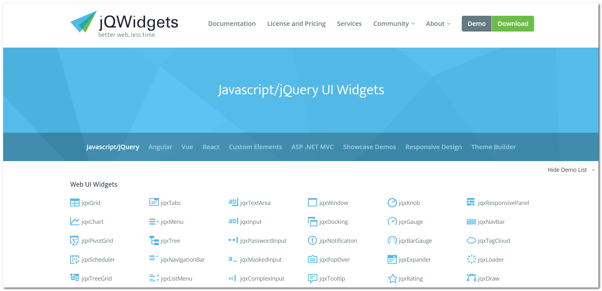

# jQWidgets使用 

Demo页官网地址：https://www.jqwidgets.com/jquery-widgets-demo

项目中最常使用的是 `jqxGrid - 表格`，但是官方文档没有中文版，**不建议直接看demo**，需要使用 `jqxGrid` 时首先参考项目中已有源码，然后还遇到一些特殊需求时再来看API及例子，查看API的方式如下图，点击 `jqxGrid` 进入 `jqxGrid` 的Demo页后，点击 `Default Functionality` - > `API Reference` ： 

