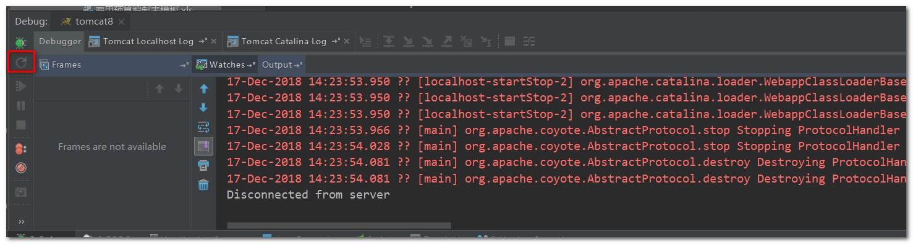
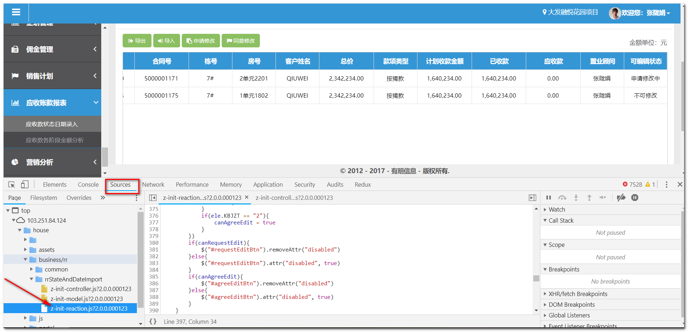

# 其它开发技巧 

## 全局搜索

IDEA默认快捷键 `Ctrl+ B`，或者连按两次 `Shift`。

全局搜索一些“特殊单词”，快速定位到需要到达的位置，注意搜索的文字尽量特殊，否则会出现很多匹配项，另外搜索后的结果**不要找包含 house_war_explored 路径的文件**。


## debug 模式

开发时应使用debug模式，无需多言，其它debug基本操作方式这里也略过。

区分啥时候需要重启—— 改变java代码后点击debug窗口的update按钮 ，如果报错，需要重启tomcat；另外，如果配置文件修改了，也必须重启tomcat；而前台页面的修改，一般只需要点击debug的update按钮即可。 




##Chrome浏览器调试

可能会出现debug窗口点击update按钮之后刷新浏览器，页面仍然没有变化，此时可能是**浏览器缓存**问题【还有一种情况，打开的网址是测试服务器网址，而改动的是本地代码】，此时可以打开Chrome浏览器的控制台，查看 `Sources` 标签页下源文件，看看源文件中是否已包含最新代码。



另外，Chrome浏览器配备了JavaScript代码的断点调试工具，具体使用方法自行百度。


##金额格式化 和 显示隐藏div

* 金额格式化

  页面需要引入js文件：

  ```html
  <script type="text/javascript" src="<%=basePath%>assets/numberFormat/accounting.js?<%=appVersion%>"></script>
  ```

  然后就可以使用 `accounting.formatMoney(XXX)` 对金额进行格式化成类似 `1,000.00` 这样的格式。

* 显示隐藏div

  页面上查询条件框需要隐藏时，“应收款”模块有一个 `common/toggle.js` 有切换显示/隐藏的公共代码，复制于原来的代码，需要使用的时候再来拷贝就可以了。