# 环境搭建

## 下载SVN

> **[info] 下载地址**
>
> https://tortoisesvn.net/downloads.html 

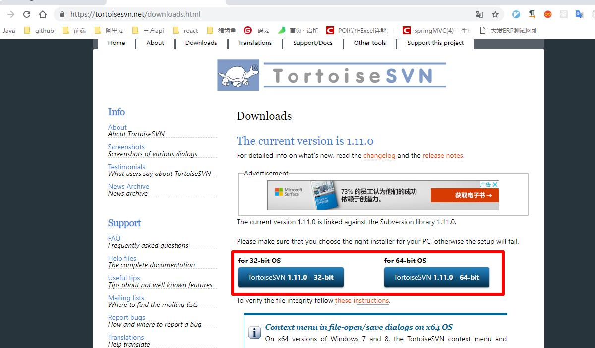

根据自己电脑位数选择红框内下载按钮下载SVN。

安装一路 `next` ，在下图页面选择红框内的选项： 

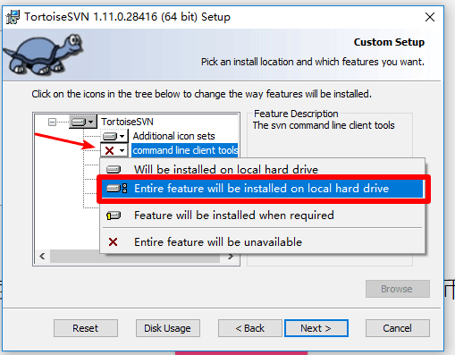

## 拉取代码

选定一个将要存放该项目的文件夹，**右键** -> `SVN checkout`  :

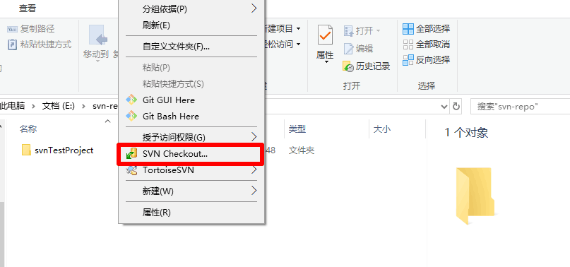

填写SVN仓库地址，确认存放目录，点击 `OK`： 

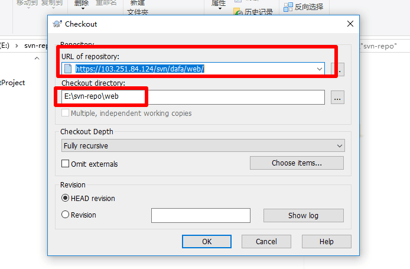

输入管理员给到的SVN账号、密码，点击 `OK`，等待下载完成即可。

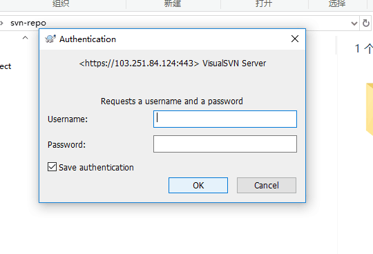

## 运行代码

使用IDEA打开项目目录，等待下方indexing完成 ：

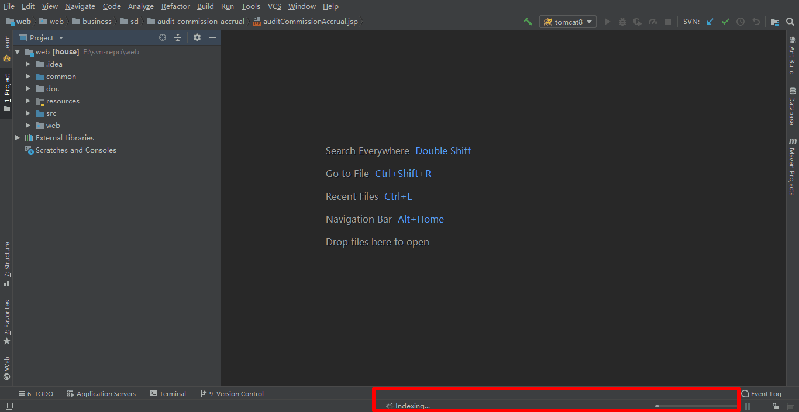

点击工具栏  `File ` ->  `Project Structure`  ->  `Libraries  ` :

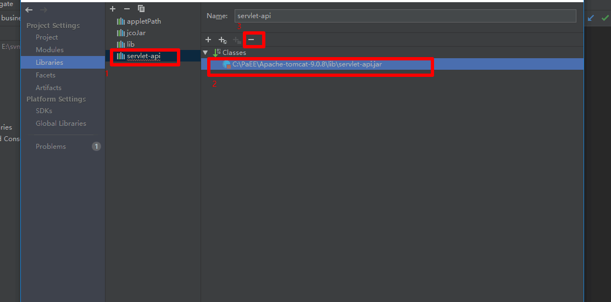

按图中顺序，删除失效的 `servlet-api.jar`。

然后点击 `+` 号，添加本地tomcat目录下的 `servlet-api.jar` 包。 

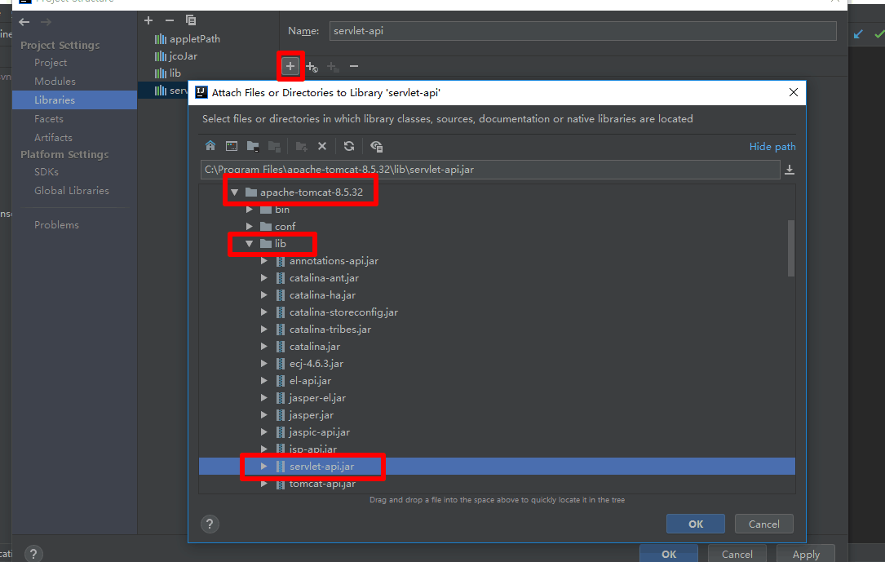

切换到 `Project` 选项卡，将 `Project language level` 切换为 `8`，其它可以不变： 

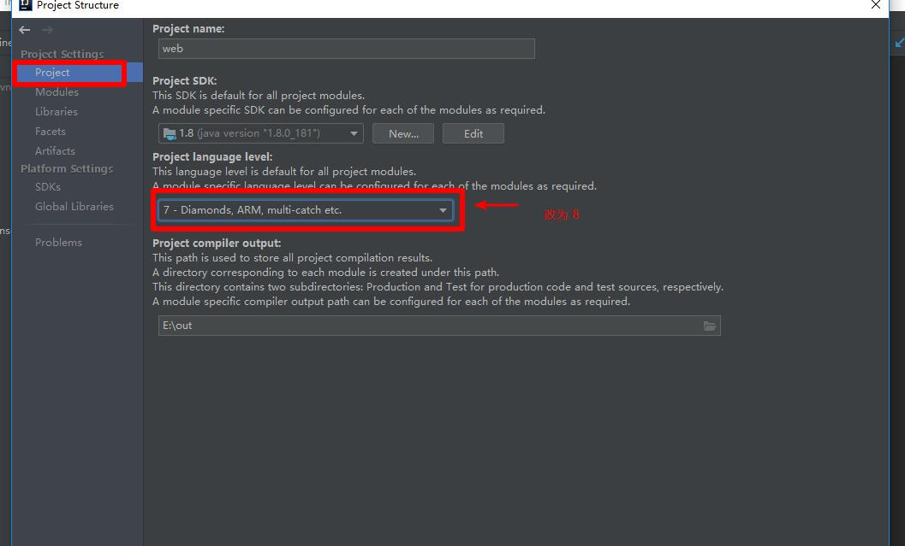

接下来配置tomcat服务器，点击 ` tomcat8` 下拉框，选择 `Edit Configurations`：

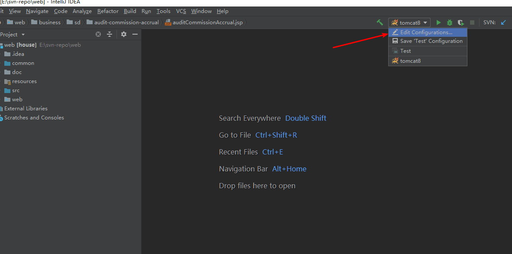

按图中序号选择tomcat的 `home` 目录。

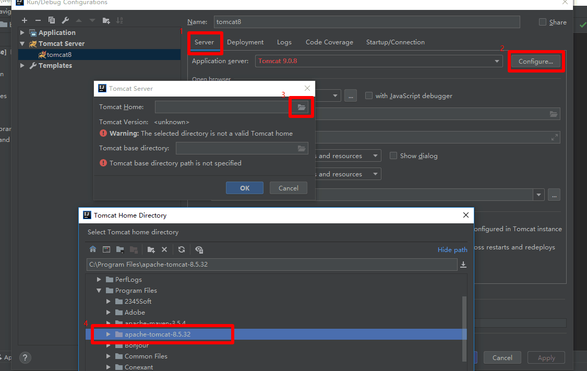

然后切换到 `Deployment` 页签，将 `Application context` 改为 `/house`， 如下图。

> **[warning] 提示**
>
> 这里最好改一下，因为原来的代码中有块公用的代码把根路径写死为 `/house` 了，这里不改的话在本地打开 包含那一块代码的页面时 会有错误。

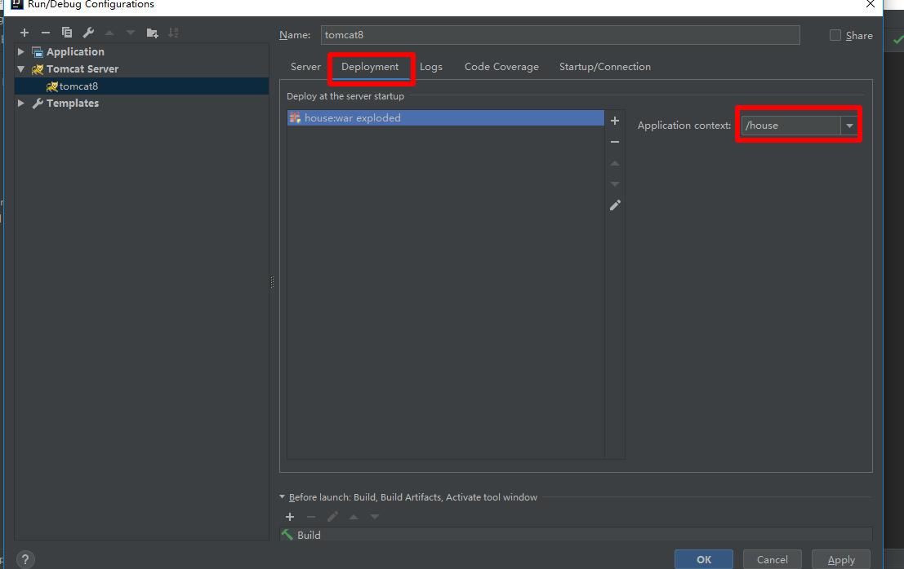

启动tomcat服务器，启动完成会自动弹出登录页。输入给到的测试账号、密码登录即可。 
