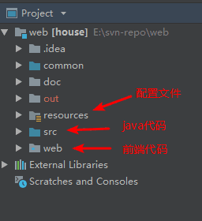
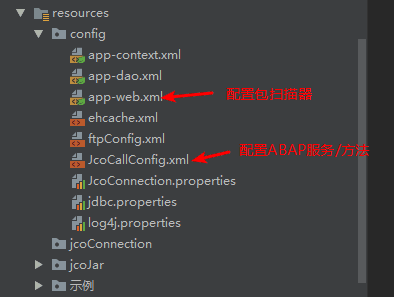
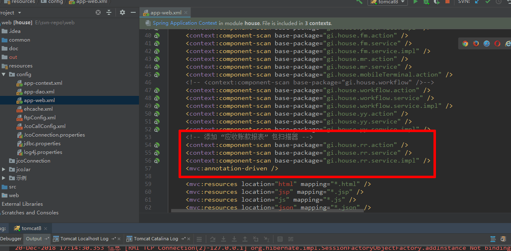
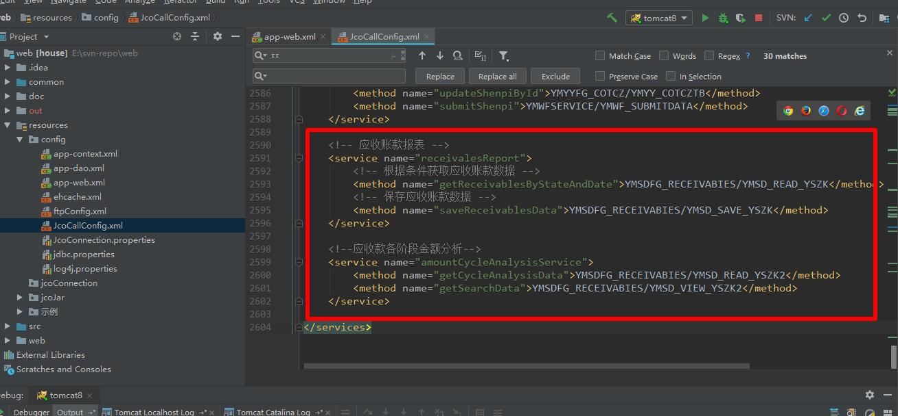
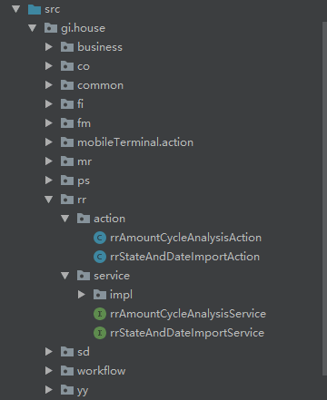
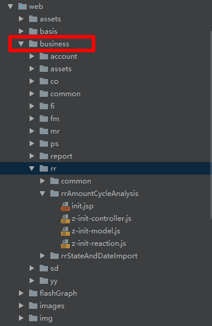

# 项目目录结构

## 项目一级目录结构

 

其中 `resources` 存放 配置文件， `src` 存放java代码， `web` 存放前端代码。 

## resources目录 

 

 `resources` 文件夹下可能会需要改动的文件:

-  `app-web.xml`【Java代码目录 `src` 中如果创建了新的 `action`、`service` 文件夹后需要在此文件中添加包扫描器】，例如添加 “应收款” 相关的java文件夹后配置包扫描器： 

  

- `JcoCallConfig.xml` 文件中配置java代码的 `Service` 层调用的ABAP方法，具体在开发那块会详细介绍，这里简单提及： 

  

## src目录

 

标准的 `SpringMVC` 的目录结构，没有 `dao` 层，因为在 `service` 层会将数据发送给SAP那边进行数据库相关操作。

## web目录

 

前端代码基本都是在 `web/business` 目录下，另外，Excel模板文件，放在 `web/assets/expFileModel` 文件夹下。 

