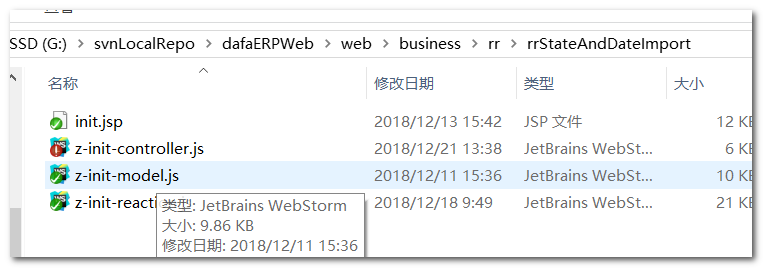
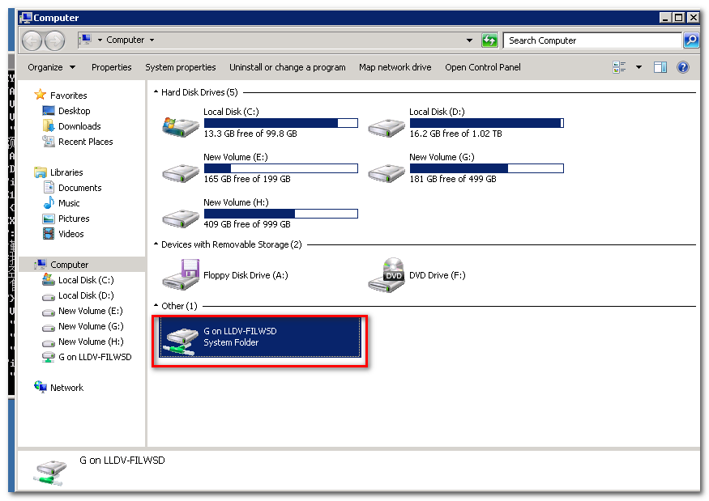

# 部署代码到测试服务器

> **部署测试服务器之前首先确保本地测试通过。** 

## 整理修改过的代码 

- 整理修改过的前端代码 

  打开项目存放目录，可以看到文件夹上有图标显示状态，感叹号的就说明该文件夹下有文件改动过，这里注意，`.idea` 文件夹和 `out` 文件夹不用管，**提交SVN的时候也必须排除**。

  

  这里 `web` 文件夹有改动，定位到改动的文件：

  

  将改动了的文件复制出来并且记下文件的路径，便于之后部署测试服务器。 

- 整理修改过的java代码 

  - 如果配置文件有改动，直接复制出来并记下文件路径即可；

  - 如果java文件有改动，不能直接把  `.java` 文件复制出来，而是需要到 `out` 文件夹中找到对应的 `.class` 文件。 

    

    如上图所示， `src/gi/house/rr/action/rrAmountCycleAnalysisAction.java` 文件有改动，返回到 `src` 同级目录找到 `out` 目录： 

    

    找到该目录下 `rrAmountCycleAnalysisAction.java` 对应的 `.class` 文件，这里的路径是：

    `out\artifacts\house_war_exploded\WEB-INF\classes\gi\house\rr\action\rrAmountCycleAnalysis.class`，将该文件复制出来并且记下文件路径。

## 连接测试服务器

首先找到电脑上的 `远程桌面连接` 快捷方式，WIN10系统下按 `WIN` 键，输入“远程桌面连接”，在该图标上 `右键` -> `打开文件位置 `： 

在弹出的窗口中右键 `远程桌面连接` 图标，点击 `发送到` -> `桌面快捷方式` :

双击桌面上的 `远程桌面连接` 图标： 

点击 `显示选项` 按钮：

输入计算机名-管理员分配的测试服务器的ip地址，输入用户名。

切换到 `本地资源` 选项卡，点击 `详细信息` 按钮，在 `驱动器` 栏中选择共享到测试服务器的本地磁盘，

>  登录测试服务器之后，测试服务器上只能访问到该磁盘中的内容，所以需要部署的代码也应该放置在该磁盘中。

输入密码，确定后即可连接到测试服务器，连接上之后，系统让选择一个 `session` 登录 :

这里必须注意，要进入正确的 `session `  (基本是第二个)-->  正确的 `session` 进入后会有 `tomcat230` 的运行界面【**注意看清楚是230而不是其它的**】。 

> - 一般tomcat230运行在第二个session，如果进入第二个session没有看到tomcat230界面，重试进入其它session看看有没有tomcat230运行窗口，**注意看清楚是230不是其它的**
>
> - 可能其他人已经登录了tomcat230的session导致暂时没办法登入
> - 如果长时间无法找到tomcat230的session，需要联系管理员。

 

## 部署新代码

双击桌面上的 `tomcat_230-shortcut` 图标，找到 `webapps` -> `house`，`house` 文件夹如下：

前端代码放置在 `business` 文件夹下，java代码和配置文件放置在 `WEB-INF` 文件夹下。

按下` WIN + E` 弹出 `computer ` 界面，此时即可看到刚刚设置的共享的磁盘（这里是之前设置的G盘）:

现在便可以拿到自己本地电脑上整理好的新代码，将这些新代码覆盖掉测试服务器的相应文件。 

最后，根据部署的代码类型，确定是否需要重启tomcat：

- 如果修改的只有前端代码，不涉及java代码和配置文件，则不需要停止tomcat进程，直接覆盖测试服务器上的源码即可；

重启 tomcat 的步骤 :

- 切换到tomcat230窗口，按下Ctrl + C即可停止tomcat进程；

- 然后点击桌面 `tomcat_230-shortcut` -> `bin `-> `startup `,双击该文件启动tomcat。 

  

等 `tomcat230` 启动成功后，关闭远程桌面连接，用浏览器访问更新过代码的页面，查看功能是否运行正常。

> 很多情况下会出现浏览器缓存导致的更新过的代码没有生效的情况。