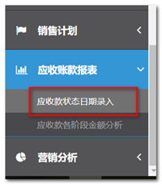
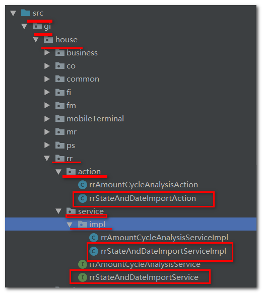
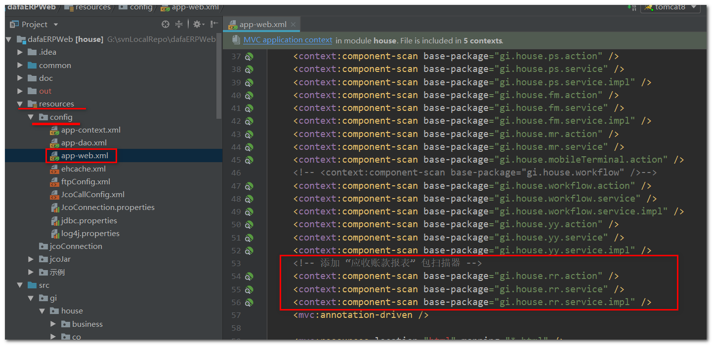
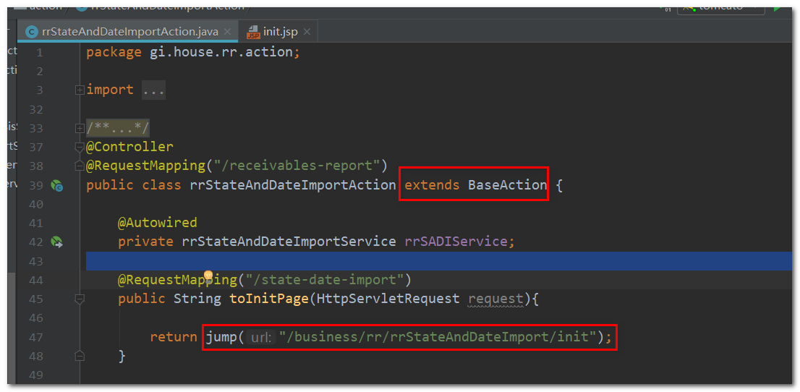
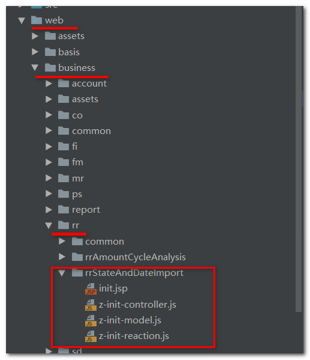
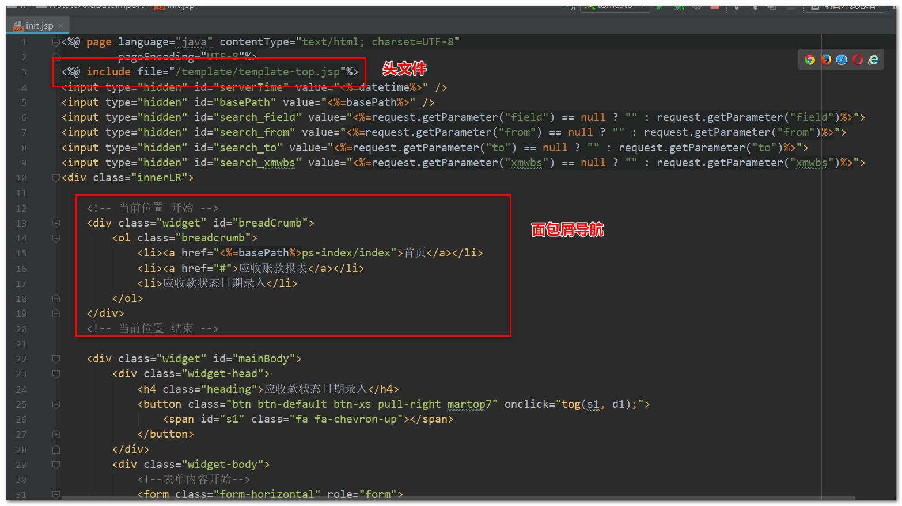
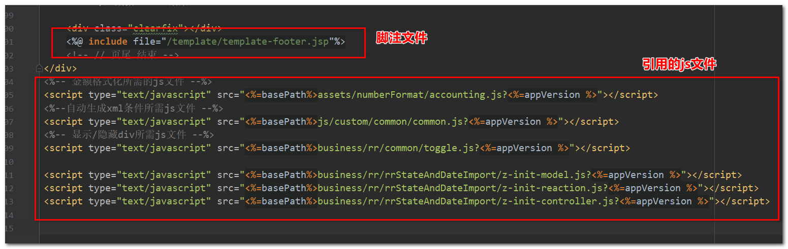
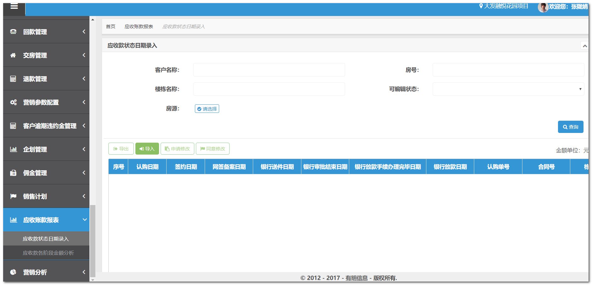

# 前端静态页面开发

> 以 " 应收款模块-应收款状态日期录入 " 为例。

  

###步骤

1. 定义一个url用于访问该页面，此处的路径是 `/receivables-report/state-date-import `,（ 这段路径中一级路径 `/receivables-report ` 是“应收账款报表”的路径，二级路径 `/state-date-import` 对应“应收款状态日期录入”二级菜单）；

2. 将路径发给ABAP开发人员，由ABAP开发人员配置好菜单，无需前台配置。ABAP开发人员添加完菜单，前台刷新页面即可看到新添加的菜单；

3. 在java代码目录 `/src/gi/house` 文件夹下新建 `rr` 目录，该目录用于存放“应收款”相关的java代码，`rr` 目录下创建标准SpringMVC开发需要的controller层文件和service层文件；

   

4. 由于 “应收款” 是新增加的模块，新建了 `rr` 目录，所以需要到配置文件中添加包扫描器自动扫描Spring注解，如下所示，打开 `resources/config/app-web.xml` ，新增包扫描器： 

      

5. 到action文件中编写方法，配置url匹配的页面地址，这里 `rrStateAndImportAction` 继承了 `BascAction`，所以可以使用 `jump` 方法跳转到页面的url :

      

6. 打开前端文件所在文件夹，在 `/web/business` 目录下新建 ` rr` 目录，用于存放 “应收账款报表” 模块所有的前端代码，然后新建 `rrStateAndDateImport` 文件夹，用于存放“应收款状态日期录入”这个二级菜单对应的前端代码:

      

       这里，`rrStateAndDateImport ` 文件夹下面的文件，一个jsp页面对应三个js文件，这是前端页面的开发规范，`controller.js`  为页面中的元素添加事件，`reaction.js` 存放事件的具体逻辑， `model.js` 存放数据模型，定义的全局变量等等（代码中很多地方没有遵守该规范，嫌麻烦也可以不创建 `model.js`）；

7. `init.jsp` 文件结构有固定的格式，**开发新页面时基于一个类似的页面修改即可**：

      

      

      头文件、脚注文件必须有，中间是内容，内容开头固定格式的面包屑导航。注意js文件的**引用顺序必须model > reaction > controller 的顺序**。其它js文件是由于后来某些功能需要才引入的，刚开始无需引入，这里先忽略;

8. 编写完 `init.jsp` 页面后，点击页面上的 “应收款状态日期录入” 菜单，即可访问到 `init.jsp` 页面： 

      

      其中的蓝色表头的表格，是使用的jqxGrid组件，jqxGrid组件的基本用法可以参考该模块的几个js文件中的写法（基本上也只会涉及一些基本用法），jqx组件的详细使用方法参见 [jqx组件使用](../others/jqx.md) 。 