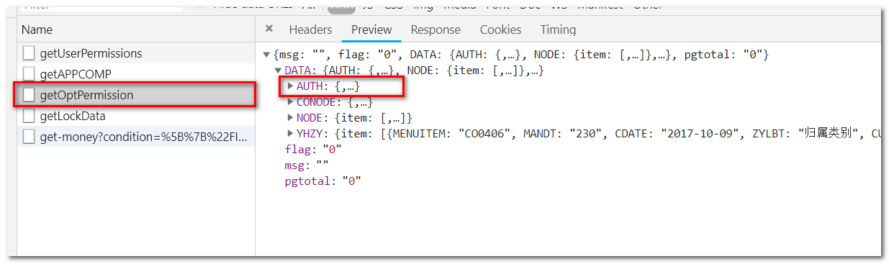
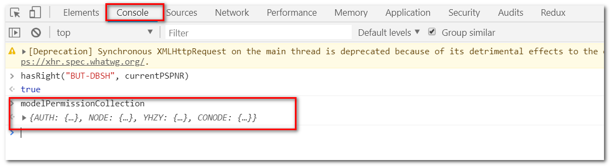
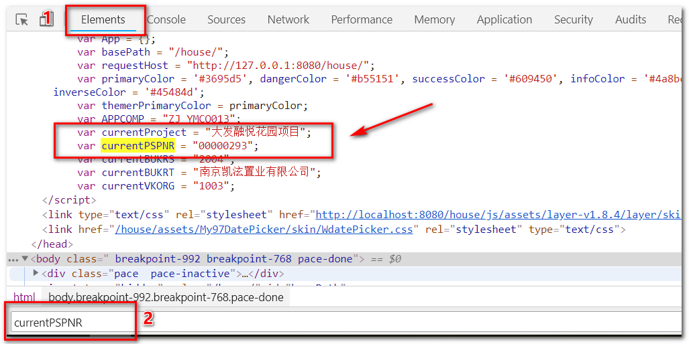

# 权限控制 

权限控制 **按钮状态** 的代码的固定格式, 如果判断当前选择的项目是否具有某个权限，直接判断 `hasRight("permissionName")` ,有权限则返回true； 如果需要**判断指定的某个项目**，使用`hasRight("permissionName", "projectId")`，判断权限格式的固定代码格式如下：

```javascript
flag = 0 //计数标记
permissionTimer = setInterval(function() {
    if(modelPermissionCollection && modelPermissionCollection.AUTH){
        if(!hasRight("BUT-SQXG") && canRequestEdit) {
            $("#requestEditBtn").attr("disabled", true)
        }
        if(!hasRight("BUT-TYXG", projectId) && canAgreeEdit){
            $("#agreeEditBtn").attr("disabled", true)
        }
        clearInterval(permissionTimer)
    }
    ++flag
    if (flag === 6){
        if(!hasRight("BUT-SQXG") && canRequestEdit) {
            $("#requestEditBtn").attr("disabled", true)
        }
        if(!hasRight("BUT-TYXG", projectId) && canAgreeEdit){
            $("#agreeEditBtn").attr("disabled", true)
        }
        clearInterval(permissionTimer)
    }
}, 500)
```

分析：  

* 设置定时器，是因为ajax异步请求获取权限信息，虽然可能有问题，但是原来代码就这么写。 

  

* `hasRight()` 函数位于 `/web/js/custom/common/common.js ` 文件中，使用时要记得在jsp中引用该文件,  `hasRight()` 的代码如下:

  ```javascript
  /**
  * function: 判断modelPermissionCollection是否有权限。
  * arguments: right, currentProjectID(默认为currentPSPNR)
  */
  function hasRight() {
      if (modelPermissionCollection != undefined && modelPermissionCollection.AUTH != undefined) {
          var projectId = arguments.length === 2 ? arguments[1] : currentPSPNR;
          var AUTH = modelPermissionCollection.AUTH.item;
          if (!AUTH.length) {
              if (!projectId) { // 没有项目时
                  if (AUTH.FIELD == arguments[0]) {
                      return true;
                  }
                  if(AUTH.FIELD == "ALL") {
                      return true;
                  }
              } else if(projectId == AUTH.ACODE) {
                  if (AUTH.FIELD == arguments[0]) {
                      return true;
                  }
                  if(AUTH.FIELD == "ALL") {
                      return true;
                  }
              }
          }
          for (var i = 0; i < AUTH.length; i++) {
              if (!projectId) { // 没有项目时
                  if (AUTH[i].FIELD == arguments[0]) {
                      return true;
                  }
                  if(AUTH[i].FIELD == "ALL") {
                      return true;
                  }
              } else if(projectId == AUTH[i].ACODE) {
                  if (AUTH[i].FIELD == arguments[0]) {
                      return true;
                  }
                  if(AUTH[i].FIELD == "ALL") {
                      return true;
                  }
              }
          }
          return false;
      }
      return false; // modelPermissionCollection.AUTH == undefined rights?
  }
  ```

  分析： 

  * `modelPermissionCollection ` 是全局变量，如果对权限有任何疑问，可以到浏览器console窗口看，如下:

    

  	 `currentPSPNR ` 也是全局变量，当前项目编码，具体可以到页面中搜索 `currentPSPNR` , 如下：	

  *  if代码段是 `AUTH` 只有一项的时候进入，for循环代码段是 `AUTH` 为数组的情况，一般都是进入for循环，分析 for循环里面的代码的有 `projectId` 的情况：遍历 `AUTH` 的每一项的 `ACODE== projectId`，看匹配到的 `AUTH` 的 `FIELD` 是否等于 `arguments[0]` （即第一个入参：权限名称，类似于“BUT-EDIT,BUT-CHECK,BUT-DELETE”这样，这些名称是ABAP端配置好的，如果需要权限控制，需要联系ABAP开发人员。）, 或者 `FIELD == "ALL"`。

